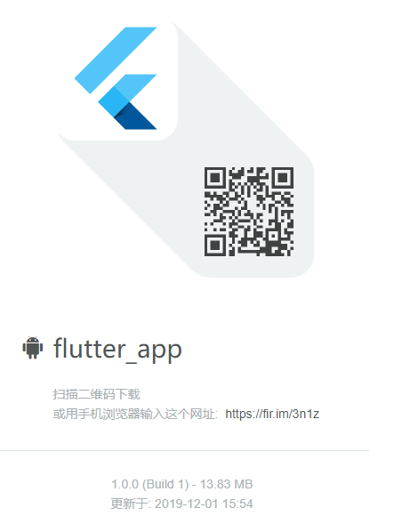

 # 前言
- 基于fluetter开发的linjiashop app版本，使用flutter 1.9.6 版本构建
- linjiashop 包含了h5,小程序，web（基于SpringBoot，Vue.js) 仓库地址[gitee](https://gitee.com/microapp/linjiashop),[github](https://github.com/microapp-store/linjiashop)
## 功能模块

- 商城功能
    - 首页
    - 发现
    - 购物车
    - 登录注册
    - 我的订单
    - 收货地址

## 技术选型
- 核心框架：flutter 1.9.6
- 数据存储：shared_preferences
- 屏幕适配：flutter_screenutil
- 路由管理：fluro
- 顶部状态栏：flutter_statusbarcolor
- 网络请求：dio
- 事件广播：event_bus
- 刷新控件：flutter_easyrefresh
- 左滑删除：flutter_slidable
- toast：fluttertoast
- 拨打客服电话：url_launcher
## 运行效果图
- App：

- 下载二维码：

## 技术交流
- QQ群：254059156
- 测试账号：15011112222 admin
- 微信：myenilu,添加请备注：邻家小铺